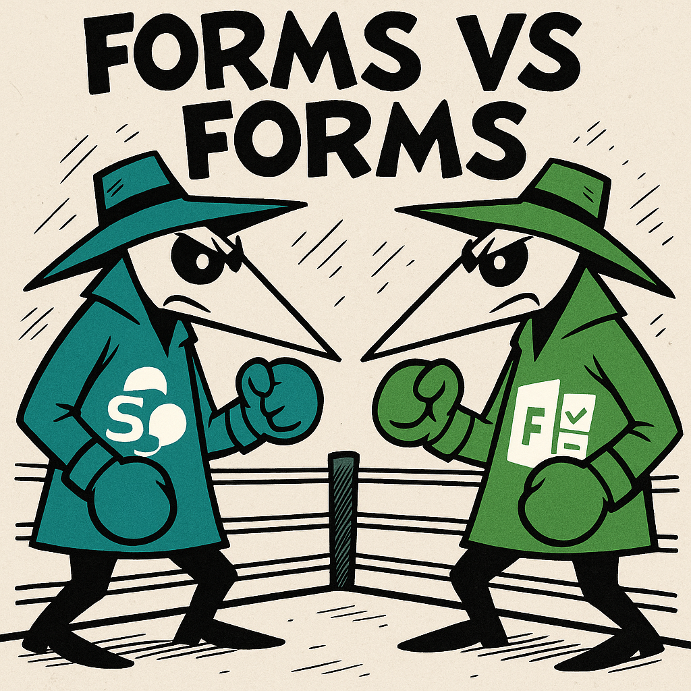

+++
author = ["Gavin Warner"]
title = "Form vs Form"
date = "2025-07-26"
description = "Discussing the difference between Sharepoint forms and Microsoft forms"
tags = [
    "Sharepoint",
    "Microsfot",
    "Forms",
]
categories = [
    "Sharepoint",
    "Microsoft",
]
+++

# Understanding the Difference Between SharePoint Forms and Microsoft Forms

When it comes to collecting information or input from users in the Microsoft ecosystem, two popular tools often come up, **SharePoint Forms** and **Microsoft Forms**. While they may sound similar, they serve different purposes and shine in different scenarios. Here’s a quick breakdown of the key differences to help you choose the right tool for your needs.

## What Are Microsoft Forms?

**Microsoft Forms** is a lightweight, easy-to-use app designed for **quick data collection**, such as surveys, quizzes, and polls. It allows users to create forms with simple drag-and-drop functionality and view results in real time.

**Common Use Cases:**
- Customer feedback surveys  
- Employee engagement polls  
- Event registrations  
- Quizzes for training or education  

**Key Features:**
- User-friendly interface  
- Mobile-friendly forms  
- Real-time results and analytics  
- Easy integration with Excel and Microsoft Teams  

## What Are SharePoint Forms?

**SharePoint Forms** are typically customized forms connected to **SharePoint lists or libraries**. These forms are often built using tools like **Power Apps** or **InfoPath** (older systems), allowing for more complex logic, automation, and integration with business processes.

**Common Use Cases:**
- Employee onboarding forms  
- IT support request forms  
- Expense reimbursement workflows  
- Custom data entry linked to document libraries  

**Key Features:**
- Deep integration with SharePoint lists  
- Advanced customization with Power Apps  
- Workflow automation via Power Automate  
- Supports permissions, data validation, and logic  

## Key Differences at a Glance

| Feature              | Microsoft Forms                     | SharePoint Forms                          |
|---------------------|-------------------------------------|-------------------------------------------|
| **Ease of Use**     | Very easy, no setup needed          | Moderate to advanced (depending on build) |
| **Customization**   | Basic (themes, question types)      | Highly customizable (with Power Apps)     |
| **Integration**     | Integrates with Excel, Teams        | Integrates with SharePoint, Power Automate|
| **Best For**        | Surveys, quizzes, simple data input | Business processes, custom data collection|
| **Automation**      | Limited                             | Advanced workflows possible               |

## When to Use Each

- **Use Microsoft Forms** when you need something **fast, simple, and user-friendly** for basic data collection.
- **Use SharePoint Forms** when your form needs to be part of a **business process**, includes **conditional logic**, or needs to store data in a **SharePoint list** for further processing or reporting.

## Final Thoughts

Both tools are powerful in their own right but are suited for different scenarios. If you're looking to digitize business processes and connect to back-end systems, SharePoint Forms (with Power Apps) is your best bet. But if you just need a quick poll or feedback form, Microsoft Forms will get the job done with minimal effort.
